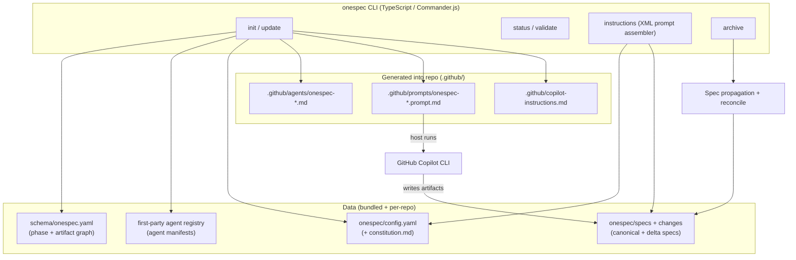

# OneSpec — Design Proposal & Architecture

Spec-driven-development (SDD) framework for the **Microsoft Singapore Agentic
Software Development Team**. A standalone tool the team runs across greenfield and
brownfield repos, with the security and quality gates that OpenSpec and SpecKit
lack.

> Status: **design proposal**. No implementation code yet — this document defines
> the plan, architecture, schemas, and contracts to build against.

---

## 0. Decisions

| Decision | Choice | Why |
|---|---|---|
| **Execution model** | Artifact-guided (OpenSpec-style). OneSpec emits artifacts + slash commands; it does **not** drive the AI itself. "Automatic after Propose" = a chained sequence of slash-command handoffs the host assistant runs. | No orchestration engine to build/maintain. Matches the tool we're reusing. |
| **Host assistant** | **GitHub Copilot CLI first-class** (generate Copilot-native agents/prompts). Agent contract kept host-agnostic so Claude Code / Cursor are a v2 add. | Team's tool; phases map to Copilot agent types. |
| **Language / packaging** | **TypeScript + Node, npm/npx** (`npx onespec init`). | Matches OpenSpec exactly → maximum convention reuse, lowest-friction init. |
| **Methodology default** | `tdd` (recommended). | Universal; BDD is the spec-native alternative. See §7. |
| **Spec location** | In-repo under `onespec/`, committed with code. | Version-controlled, brownfield-friendly. Shared/remote store = v2. |

---

## 1. Problem, goals, non-goals

### Problem
OpenSpec is light and artifact-guided but has **zero** built-in quality/security
gates. SpecKit is phase-gated with a constitution but **also** has no security,
threat-modeling, code-review, or supply-chain phases (confirmed: SpecKit lists
these only as *future extensions*). The team needs one SDD tool that bakes these
in as first-class phases, enforces anti-over-engineering during implementation,
and keeps specs as a drift-free single source of truth.

### Goals
1. One-command init on par with `openspec init`, sensible defaults.
2. `config.yaml` is the machine-readable source of truth; an optional English
   **constitution** carries human intent. Config wins; prose guides.
3. Specs are the single source of truth; a change to one spec propagates to every
   affected spec — no drift. Explicit reconciliation at Archive.
4. Manual gates for Ideation + Propose; agentic handoff chain for everything after.
5. Anti-over-engineering ("ponytail") actively enforced during Implement, not just documented.
6. Security-Review, Threat-Model (STRIDE), Supply-Chain-Audit, Code-Review are
   **first-class phases**, each bound to a first-party agent.
7. Works for greenfield and brownfield; specs version-controlled in-repo.

### Non-goals (v1)
- ❌ Plugin **marketplace** / third-party agent install (v2).
- ❌ Multi-assistant generation beyond Copilot (Claude/Cursor/etc. = v2; contract stays host-agnostic).
- ❌ Bespoke orchestration / API-driven agent runs (execution stays artifact-guided).
- ❌ Shared/remote spec store (OpenSpec "stores" beta). Specs live in-repo.
- ❌ Rewriting OpenSpec/SpecKit — we reuse conventions, not fork the code.

---

## 2. Architecture

Artifact-guided: the CLI is a **template + config + generator** engine. It never
calls a model. The host (Copilot CLI) does all AI work by running generated
slash commands whose prompts OneSpec assembles.



### State machine (phases + gates)

```mermaid
stateDiagram-v2
  direction LR
  [*] --> Initialization
  Initialization --> Ideation: manual
  Ideation --> Propose: manual
  Propose --> Implement: APPROVE gate
  Implement --> CodeReview: handoff (prompt: switch model)
  CodeReview --> SecurityReview: handoff
  SecurityReview --> ThreatModel: handoff (STRIDE)
  ThreatModel --> SupplyChain: handoff
  SupplyChain --> Archive: handoff
  Archive --> [*]: specs reconciled
```



- **Manual gate at Propose** is the only hard human stop (borrowed from SpecKit's
  `review-plan` gate). Approving it flips the change to agentic.
- **"Automatic" = handoff chaining**, not orchestration: each agentic phase's
  prompt ends with a handoff to the next phase's slash command (SpecKit
  `handoffs:` front-matter pattern + OpenSpec skill handoffs). The host executes
  the chain. A `/onespec-run` driver prompt can also walk remaining phases.
- **No state-machine file.** Phase completion is *inferred from artifact
  existence* (OpenSpec pattern): `onespec status` checks which artifacts a change
  has vs the schema graph and reports `done / ready / blocked`.

### Components
| Component | Reuse source | Role |
|---|---|---|
| CLI (Commander.js) | OpenSpec as-is | `init`, `update`, `status`, `validate`, `instructions`, `archive` |
| Config engine | OpenSpec `config.yaml` + SpecKit constitution | Load config + constitution; inject as XML into prompts |
| Phase/artifact graph | OpenSpec `schema.yaml` (extended) | Declares phases, artifacts, deps, templates, bound agents — **data, not code** |
| Instruction engine | OpenSpec `openspec instructions` | Assemble `<project_context>/<rules>/<template>/<instruction>` XML per artifact |
| First-party agent registry | **new** (contract §4) | Bundled agent manifests → phase bindings + generated slash commands |
| Generator | SpecKit Copilot integration | Write `.github/agents`, `.github/prompts`, `.github/copilot-instructions.md` |
| Spec engine | OpenSpec delta-merge + SpecKit `/analyze` | Merge delta specs on archive; reconcile + flag cross-spec drift |

---

## 3. `config.yaml` schema (draft)

Proven OpenSpec fields (`schema`, `context`, `rules`) + OneSpec additions
(`methodology`, `constitution`, `phases`, `host`).

```yaml
schema: onespec              # phase+artifact graph name (bundled default)
host: github-copilot         # v1 target; enum kept for v2 hosts
methodology: tdd             # tdd | bdd | contract-first | test-after | lean
constitution: ./constitution.md   # pointer to human-intent doc (SpecKit-style)

context: |                   # project background -> <project_context> in every prompt
  Tech stack: ...
  Product language: describe observable behavior, not implementation.

rules:                       # per-artifact constraints -> <rules> for that artifact
  specs:      [ "Requirements describe observable behavior only" ]
  design:     [ "Document platform-specific behavior" ]
  tasks:      [ "Add a test task per requirement (methodology=tdd)" ]
  implement:  [ "Ponytail ladder is binding (see constitution)" ]

# Phase -> first-party agent bindings, drawn from the built-in roster.
phases:
  ideation:        { gate: manual,  agent: onespec-explorer }
  propose:         { gate: manual,  agent: onespec-proposer }
  implement:       { gate: agentic, agent: onespec-implementer }
  code-review:     { gate: agentic, agent: onespec-code-reviewer, model_switch: true }
  security-review: { gate: agentic, agent: onespec-security-reviewer }
  threat-model:    { gate: agentic, agent: onespec-threat-modeler }   # STRIDE
  supply-chain:    { gate: agentic, agent: onespec-supply-chain-auditor }
  archive:         { gate: agentic, agent: onespec-spec-reconciler }
```

`config.yaml` **wins** over the constitution on any conflict. The constitution is
prose that shapes agent behavior and is checked at a **Constitution Check** gate
(SpecKit pattern) inside Propose.

---

## 4. First-party agent contract

v1 ships a **fixed roster** (no marketplace). Each agent is a **manifest** — pure
data — so a v2 marketplace reuses the exact contract by adding more manifests.

```yaml
# registry/onespec-security-reviewer/agent.yaml
id: onespec-security-reviewer
name: Security Reviewer
phases: [security-review]        # one or more phases it binds to
produces: [security-review.md]   # artifact(s) it writes into the change folder
model_hint: null                 # optional; code-reviewer sets this to prompt a switch
commands:                        # slash commands this agent contributes
  - id: security-review
    summary: Review produced code for vulnerabilities
    handoff: threat-model        # next phase in the chain
instruction: ./instruction.md    # the prompt body (host-agnostic markdown)
```

- **Binding**: `config.yaml.phases.<phase>.agent` references a roster `id`.
- **Commands carry their own prompts**: `instruction.md` is host-agnostic; the
  Generator renders it into the host's format (Copilot
  `.github/prompts/onespec-<id>.prompt.md` today; Claude/Cursor adapters later —
  same manifest).
- **Handoff chain** (`commands[].handoff`) is what makes post-Propose phases run
  automatically without an orchestrator.
- **v1 roster**: `explorer`, `proposer`, `implementer` (ponytail), `code-reviewer`
  (model-switch), `security-reviewer`, `threat-modeler` (STRIDE),
  `supply-chain-auditor`, `spec-reconciler`.

**Ponytail enforcement** lives in `onespec-implementer/instruction.md`: the
ponytail ladder (YAGNI → reuse-before-write → stdlib → native → installed dep →
one line → minimum code; mark simplifications) is the implementer's binding
operating contract, injected as `<rules>`. Code-Review then flags unrequested
abstractions as a review finding — enforcement in two places, not just docs.

---

## 5. Spec single-source-of-truth strategy

Reuse OpenSpec's delta mechanism, harden it with SpecKit `/analyze`-style
consistency so a change to one spec can't silently break another.

1. **Canonical specs**: `onespec/specs/<domain>/spec.md`, format
   `### Requirement:` + `#### Scenario:` (WHEN/THEN/GIVEN/AND; SHALL/SHOULD/MAY).
2. **Delta specs in a change**: `changes/<name>/specs/<domain>/spec.md` using
   `## ADDED / MODIFIED / REMOVED / RENAMED Requirements`.
3. **Archive-time propagation** (`onespec-spec-reconciler`): apply deltas in order
   RENAMED → REMOVED → MODIFIED → ADDED into canonical specs; conflicts require
   manual resolution.
4. **No-drift reconciliation** (the OneSpec addition): before archive completes,
   an `/analyze`-style read-only pass maps requirement ↔ scenario ↔ task coverage
   **and cross-spec references**. If the change modifies spec A and specs B/C
   reference A's requirements, those are flagged as *affected* and the change is
   **blocked from archiving** until it includes deltas for B/C (or explicitly
   waives them). *Detect-and-require*, not auto-rewrite — auto-editing sibling
   specs is the risky path.
5. `onespec validate` (OpenSpec-style) runs the same checks anytime, not just at archive.

---

## 6. Reuse plan + team adoption

### Adopt from OpenSpec **as-is**
- `onespec/` directory shape (`config.yaml`, `specs/`, `changes/`, `changes/archive/`).
- Change folder: `proposal.md`, `design.md`, `tasks.md`, `specs/` delta, `.onespec.yaml`.
- Spec + delta format (Requirement/Scenario; ADDED/MODIFIED/REMOVED/RENAMED).
- Schema-driven artifact graph; dynamic XML instruction injection.
- CLI surface (`init/update/status/validate/instructions/archive`), TS/Node/npm.
- Slash-command install-on-init; status inferred from artifact existence.

### Adopt from SpecKit
- **Constitution** doc + **Constitution Check** gate + Sync Impact Report propagation.
- **`/analyze`** cross-artifact consistency passes (→ the no-drift engine).
- Human review **gate** (Propose approval) + `handoffs:` front-matter (→ the chain).
- Copilot integration shape: `.github/prompts/*.prompt.md` + `.github/copilot-instructions.md`.

### Change / add (the differentiator)
- New first-class phases + agents: Code-Review, Security-Review, Threat-Model
  (STRIDE), Supply-Chain-Audit — none exist in either tool.
- Extend the schema graph to sequence these after Implement via handoffs.
- Harden spec propagation with cross-spec drift blocking (stronger than OpenSpec).
- Bake ponytail into the implementer contract.

### Adoption
- **Greenfield**: `npx onespec init` → scaffolds `onespec/`, empty `specs/`,
  `config.yaml`, `constitution.md`, and Copilot `.github/*`. Start at Ideation.
- **Brownfield**: `npx onespec init` in an existing repo; first Ideation reads the
  code and seeds `specs/` from current behavior (OpenSpec's explore-first pattern).
  `onespec validate` surfaces drift on legacy specs over time.
- Per-repo (specs version-controlled with code). Global `npm i -g @msft-sg/onespec`
  or zero-install `npx`.

---

## 7. Open decisions (recommendations)

- **Methodology default → `tdd`.** Menu: `tdd` (test-first, default), `bdd`
  (scenario-first — maps cleanest to Given/When/Then specs; strong alt),
  `contract-first` (schema/types as contract), `test-after`, `lean` (tests on
  critical paths only, ponytail-native). Methodology tunes the `tasks` rules +
  implementer instructions.
- **Specs location → in-repo** under `onespec/`, committed with code. Shared/remote
  store deferred to v2.
- **Distribution → `npx onespec init` per repo** + optional global install.
- Still worth confirming before build: (a) exact Copilot CLI artifact paths
  (`.github/agents` vs `.github/prompts` vs skills) against the team's Copilot
  setup; (b) whether Threat-Model + Supply-Chain run per-change or once per repo
  milestone.

---

## 8. Build roadmap (phases)

1. **Core scaffold** — TS/Node CLI, `onespec/` dir, `config.yaml`, constitution,
   bundled `onespec` schema (reuse OpenSpec shape). `init` + `status`.
2. **Instruction + generator engine** — XML prompt assembler; Copilot
   `.github/agents` + `.github/prompts` + `copilot-instructions.md`; handoff chaining.
3. **Agent registry + manual phases + Implement** — agent manifest contract;
   `explorer` (Ideation), `proposer` (Propose + approval gate), `implementer`
   (ponytail baked in).
4. **Differentiator phases** — `code-reviewer` (model-switch prompt),
   `security-reviewer`, `threat-modeler` (STRIDE), `supply-chain-auditor`;
   artifacts + handoff sequence.
5. **Spec propagation + no-drift** — delta merge on archive; `/analyze`-style
   reconciliation blocking; `onespec validate`.
6. **Constitution gate** — Constitution Check inside Propose; Sync Impact Report propagation.
7. **Brownfield + docs** — brownfield init/seed, `agent-contract` JSON output, adoption docs.

---

## Appendix — prior art studied

- **OpenSpec** (Fission-AI/OpenSpec): TypeScript/Node, npm, Commander.js. Flow
  `explore → propose → apply → [sync] → archive`. `openspec/` dir, change folders,
  delta specs (ADDED/MODIFIED/REMOVED/RENAMED), schema-driven artifact graph,
  dynamic XML instruction injection, status-by-artifact-existence. **Reused
  heavily.**
- **SpecKit** (github/spec-kit): Python/uv. Phase-gated with a `constitution.md`,
  Constitution Check gate, `/analyze` cross-artifact consistency checker, human
  review gates, `handoffs:` front-matter, Copilot `.github/prompts` +
  `copilot-instructions.md`. **No** security/threat/supply-chain/code-review
  phases — the gap OneSpec fills. **Constitution + `/analyze` borrowed.**
